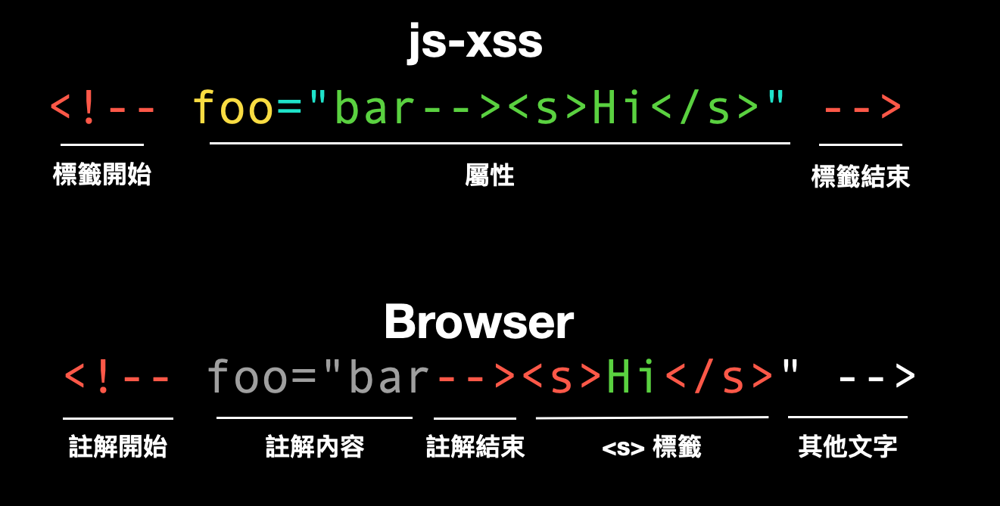

# XSS 的第一道防線：Sanitization

講完了 XSS 的各種基本知識以及攻擊手法，該來談一下防禦了。從這篇開始會正式進入到第二章：「XSS 的防禦方式以及繞過手法」。

之前在講 XSS 的防禦時其實就有提過，我們可以將使用者的輸入做編碼，讓它不被解析為原本的意思，就能夠避免掉風險。

除了編碼以外，還有另外一種方式比較像是「把使用者輸入中有危害的部分清除」，這個操作就叫做 sanitization，中文翻作「消毒」或是「淨化」，而通常負責處理的程式會叫做 sanitizer。

這個跟前面講的「編碼（encode）」或是「跳脫（escape）」有一些細微的差別，一個只是把使用者的輸入中的特定字元編碼，最後還是會以純文字顯示出來，而 sanitization 是把不符合規則的地方整個拿掉，全部刪掉。

在進入正題之前，一樣先來看一下上一篇的解答。在上一篇尾聲我有貼了一段程式碼，問大家有什麼問題：

``` js
// 這是一個可以在 profile 頁面嵌入自己 YouTube 影片的功能
const url = 'value from user'

// 確保是 YouTube 網址的開頭
if (url.startsWith('https://www.youtube.com/watch')) {
  document.querySelector('iframe').src = url
}
```

這段程式碼的問題在於針對網址的驗證不夠嚴謹，導致使用者可以輸入非影片的網址，例如說 `https://www.youtube.com/watch/../account`，就會出現帳號設定的頁面。

但這聽起來還好對吧？不過就是別的 YouTube 頁面，再怎麼樣應該都在 YouTube 才對。

照理來說是這樣沒錯，除非網站裡面有一個 [open redirect](https://blog.huli.tw/2021/09/26/what-is-open-redirect/) 的漏洞，可以重新導向到任何網址，攻擊者就可以控制 iframe 顯示的內容。

舉例來說，假設 `https://www.youtube.com/redirect?target=https://blog.huli.tw` 會導到 `https://blog.huli.tw`，我就可以用這個網址讓 iframe 顯示我的部落格，而不是預期中的 YouTube 影片。

而 YouTube 目前確實有 open redirect 的網址可以運用，因為隨時都有可能會被修復，網址我就不附了。

如果要對 URL 做驗證的話，最推薦的還是使用 `new URL()` 去解析，並且根據回傳值做判斷，會比單純使用字串比對或是 RegExp 堅固許多。

小測驗解答完了，接著就來仔細講講該如何處理使用者的輸入。

## 最基本的手段：編碼

為什麼 XSS 攻擊會成立？

因為工程師預期使用者的輸入應該只是單純的文字輸入，可是事實上這些輸入卻會被瀏覽器解析為 HTML 程式碼的一部分，就是這個差異造就出了攻擊。這就跟 SQL injection 一樣，我以為你輸入的是個字串，結果這個字串卻被解讀為 SQL 指令的一部分。

因此，修復方式很簡單，就是編碼並讓使用者的輸入變成它該有的樣子。

以前端來說，在 JavaScript 裡面要把使用者的輸入放到畫面上時，記得使用 `innerText` 或是 `textContent` 而不是 `innerHTML`，就不會有事了，使用者的輸入就會被解讀為是純文字。

而無論是 React 或是 Vue，都已經內建了類似的功能，它的基本邏輯就是：

> 原本 render 的所有東西預設就會是純文字，有需要 render HTML 再用特殊的方法就好（如 `dangerouslySetInnerHTML` 或是 `v-html`）

至於後端的話，以 PHP 來說，可以使用 [htmlspecialchars](https://www.php.net/manual/en/function.htmlspecialchars.php) 這個函式，在文件中的表格有顯示它會編碼哪些字元：


不過現在很多後端也不會直接輸出東西了，都是透過模板引擎（template engine）來做的，例如說常見的 `handlebarsjs`，用 `{{ name }}` 來代表預設就會編碼的輸出，要三個大括號才會是 raw 格式：`{{{ vulnerable_to_xss }}}`。

而 Laravel 使用的 Blade 中，`{{ $text }}` 是編碼過的，`{!! $text !!}` 則是沒編碼的，不知道驚嘆號是不是警告的意思：「欸，要小心使用啊」。

還有一些模板引擎是用 filter，例如說 Python 的 Jinja，`{{ text }}` 是編碼過的，而 `{{ text | safe }}` 代表這段內容很安全，可以直接輸出，因此是原始格式。

因此我們在寫程式的時候，都預設用安全的方式撰寫即可，需要留意的是那些不安全的（還有之前提過的 `<a href>` 的問題，也要特別留意）。

那到底什麼時候會用到不安全的輸出方式呢？

通常都是這段文字原本就是 HTML，例如說部落格平台的文章可能會支援部分的 HTML 標籤，這都是很常見的狀況。

那這種情形該怎麼處理呢？這就是要做 sanitize 的時候了。

## 處理 HTML

老話一句，用別人已經做好的 library，不要想著自己做。

如果你在用的框架或是程式語言已經有提供相關的功能，用就對了。沒有的話就去找一個口碑好或是很多人在用的 library。當然，這個 library 也可能會有漏洞，這是一定的，但通常它們都考慮到很多狀況了，也修過很多 issue，無論如何都會比你自己做的周詳很多。

而且這些 library 必須是「原本就拿來做 sanitization」的 library，否則也算是自己做。

例如說 Python 有個 `BeautifulSoup` 的 library，它可以解析網頁，很多人拿來做爬蟲，但它並不是做 sanitization 的，所以用它有可能會出事。

咦，雖然它不是，但是它是拿來解析網頁的啊？這也不行嗎？

用說的太抽象了，我示範給你看：

``` python
from bs4 import BeautifulSoup
html = """
  <div>
    test
    <script>alert(1)</script>
    
  </div>
"""
tree = BeautifulSoup(html, "html.parser")
for element in tree.find_all():
  print(f"name: {element.name}")
  print(f"attrs: {element.attrs}")
```

這個程式的輸出為：

```
name: div
attrs: {}
name: script
attrs: {}
name: img
attrs: {'src': 'x', 'onerror': 'alert(1)'}
```

看起來完全沒有問題，把標籤名稱跟屬性都解析出來了，這樣我自己建一個 allow list 或是 block list 不就好了嗎？聽起來很合理，但其實⋯⋯

``` python
from bs4 import BeautifulSoup
html = """
  <div>
    test
    <!--><script>alert(1)</script>-->
  </div>
"""
tree = BeautifulSoup(html, "html.parser")
for element in tree.find_all():
  print(f"name: {element.name}")
  print(f"attrs: {element.attrs}")
```

輸出的結果為：

```
name: div
attrs: {}
```

看起來也沒什麼異狀，但如果你把上面的 HTML 用瀏覽器打開，就會看到我們最愛的彈出視窗，代表 JavaScript 是有被執行的，也表示 BeautifulSoup 的檢查已經被成功繞過了。

繞過的原理在於瀏覽器以及 BeautifulSoup 對於底下這段 HTML 的解析不同：

``` html
<!--><script>alert(1)</script>-->
```

BeautifulSoup 的 HTML parser 會看成這是一個用 `<!--` 跟 `-->` 包住的註解，因此當然不會解析出任何標籤以及屬性。

但是呢，根據 [HTML5 的 spec](https://html.spec.whatwg.org/multipage/syntax.html#comments)，`<!-->` 是一個合法的空註解，因此上面那段就變成是註解加 `<script>` 標籤再加上文字 `-->`。


利用這樣的 parser 差異，攻擊者就可以繞過檢查並且成功執行 XSS。

順帶一提，如果把 BeautifulSoup 的 parser 換成 `lxml` 的話一樣解析不出來，但換成 `html5lib` 的話，就會被正確解析為 `<script>`，不過不知道會不會有其他問題就是了。

（這是我從 CTF 學到的技巧，參考資料為 [irisctf2023 - Feeling Tagged (Web)](https://github.com/Seraphin-/ctf/blob/master/irisctf2023/feelingtagged.md) 以及 [HackTM CTF Qualifiers 2023 - Crocodilu](https://ctf.zeyu2001.com/2023/hacktm-ctf-qualifiers/crocodilu#bypassing-html-sanitization)）

那有沒有推薦哪些專門用來做 sanitization 的 library 呢？有，我剛好知道一個。

### DOMPurify

[DOMPurify](https://github.com/cure53/DOMPurify) 是來自德國的資安公司 Cure53 所開源的套件，就是專門拿來做 HTML sanitization 的。Cure53 有很多成員都是專精於 Web 以及網頁前端，也曾經回報過許多知名的漏洞，在這一塊是很專業的。

DOMPurify 最基本的使用方式是這樣：

``` js
const clean = DOMPurify.sanitize(html);
```

它背後做的事情其實很多，不只是清除危險的標籤以及屬性，連其他攻擊像是 DOM clobbering 也一起防禦了，做得很徹底。

而 DOMPurify 預設允許的標籤都是很安全的標籤，像是 `<h1>`、`<p>`、`<div>` 以及 `<span>` 這種，而屬性的話也會幫你把 event handler 全部拿掉，之前講到的 javascript: 偽協議也是全部清掉，確保你放入任何 HTML，在預設的情形下都不會有 XSS。

但有一點要特別注意的是，`<style>` 標籤預設是可以使用的，相關的風險我們之後會再提到。

如果想要允許多一點的標籤或是屬性，也可以調整相關的設定：

``` js
const config = {
  ADD_TAGS: ['iframe'],
  ADD_ATTR: ['src'],
};

let html = '<div><iframe src=javascript:alert(1)></iframe></div>'
console.log(DOMPurify.sanitize(html, config))
// <div><iframe></iframe></div>

html = '<div><iframe src=https://example.com></iframe></div>'
console.log(DOMPurify.sanitize(html, config))
// <div><iframe src="https://example.com"></iframe></div>
```

從上面的例子中可以看出，就算我們允許了 iframe 的 src，有危險的內容一樣會自動被過濾掉，這是因為我們只是允許了 src 標籤，並沒有一併允許 `javascript:` 的使用。

但如果你自己要允許一些會造成 XSS 的屬性或標籤，DOMPurify 也不會攔你：

``` js
const config = {
  ADD_TAGS: ['script'],
  ADD_ATTR: ['onclick'],
};

html = 'abc<script>alert(1)<\/script><button onclick=alert(2)>abc</button>'
console.log(DOMPurify.sanitize(html, config))
// abc<script>alert(1)</script><button onclick="alert(2)">abc</button>
```

DOMPurify 的文件寫得滿詳細的，而且特別有一頁是 [Security Goals & Threat Model](https://github.com/cure53/DOMPurify/wiki/Security-Goals-&-Threat-Model)，裡面介紹了這個 library 的目標是什麼，以及在哪些狀況之下可能會出事。

## 正確的函式庫，錯誤的使用方式

在使用這些函式庫時，也要記得透過官方文件學習使用方法，並且在使用時多加注意，因為正確的函式庫如果搭配上錯誤的設定，一樣會造成問題。

第一個經典案例是台灣知名駭客 orange 在 2019 發現的漏洞，HackMD 在過濾內容時，使用了以下的設定（HackMD 用的是另外一套叫做 js-xss 的套件）：

``` js
var filterXSSOptions = {
  allowCommentTag: true,
  whiteList: whiteList,
  escapeHtml: function (html) {
    // allow html comment in multiple lines
    return html.replace(/<(?!!--)/g, '&lt;').replace(/-->/g, '-->').replace(/>/g, '&gt;').replace(/-->/g, '-->')
  },
  onIgnoreTag: function (tag, html, options) {
    // allow comment tag
    if (tag === '!--') {
            // do not filter its attributes
      return html
    }
  },
  // ...
}
```

如果 tag 是 `!--` 的話，就直接忽略回傳。原意是想要保留註解，例如說 `<!-- hello -->`，就會被看作是一個名為 `!--` 的 tag。

但 orange 利用了這樣的方式繞過：

``` html
<!-- foo="bar--><s>Hi</s>" -->
```

由於 `<!--` 被看作是一個標籤，所以上面的內容就只是多了 `foo` 這個屬性而已。可是當瀏覽器渲染時，開頭的 `<!--` 會跟 `foo` 中的 `bar-->` 搭配，變成 HTML 註解，後面的 `<s>Hi</s>` 就跑出來了，變成一個 XSS 漏洞。



更詳細的過程以及修補方式可以參考原文：[A Wormable XSS on HackMD!](https://blog.orange.tw/2019/03/a-wormable-xss-on-hackmd.html)

而我自己在 2021 年時也發現過成因不同，但一樣是誤用的案例。

有一個網站在後端先對 `article.content` 做了 sanitization，而前端 render 時是這樣寫的：

``` jsx
<>
  <div
    className={classNames({ 'u-content': true, translating })}
    dangerouslySetInnerHTML={{
      __html: optimizeEmbed(translation || article.content),
    }}
    onClick={captureClicks}
    ref={contentContainer}
  />

  <style jsx>{styles}</style>
</>
```

已經過濾好的內容，卻又經過了 `optimizeEmbed` 的處理，意思就是如果 `optimizeEmbed` 有問題的話，一樣會造成 XSS。

我們來看一下這函式在做什麼（有省略部分程式碼）：

``` js
export const optimizeEmbed = (content: string) => {
  return content
    .replace(/\<iframe /g, '<iframe loading="lazy"')
    .replace(
      /]*?src\s*=\s*['\"]([^'\"]*?)['\"][^>]*?>/g,
      (match, src, offset) => {
        return /* html */ `
      <picture>
        <source
          type="image/webp"
          media="(min-width: 768px)"
          srcSet=${toSizedImageURL({ url: src, size: '1080w', ext: 'webp' })}
          onerror="this.srcset='${src}'"
        />
        
      </picture>
    `
      }
    )
}
```

這邊直接拿 image URL 去做字串拼接，而且屬性也沒有用單引號跟雙引號包住！如果我們可以控制 `toSizedImageURL`，就可以做出 XSS 漏洞。這個函式的實作如下：

``` js
export const toSizedImageURL = ({ url, size, ext }: ToSizedImageURLProps) => {
  const assetDomain = process.env.NEXT_PUBLIC_ASSET_DOMAIN
    ? `https://${process.env.NEXT_PUBLIC_ASSET_DOMAIN}`
    : ''
  const isOutsideLink = url.indexOf(assetDomain) < 0
  const isGIF = /gif/i.test(url)

  if (!assetDomain || isOutsideLink || isGIF) {
    return url
  }

  const key = url.replace(assetDomain, ``)
  const extedUrl = changeExt({ key, ext })
  const prefix = size ? '/' + PROCESSED_PREFIX + '/' + size : ''

  return assetDomain + prefix + extedUrl
}
```

如果 URL 沒有符合指定條件，就會直接回傳；反之，就會做一些字串處理之後回傳。總而言之呢，我們確實可以控制這個函式的回傳值。

若是傳入的網址是 `https://assets.matters.news/processed/1080w/embed/test style=animation-name:spinning onanimationstart=alert(1337)`，最後拼接後的 HTML 就會是：

``` html
<source
  type="image/webp"
  media="(min-width: 768px)"   
  srcSet=https://assets.matters.news/processed/1080w/embed/test 
  style=animation-name:spinning 
  onanimationstart=console.log(1337)
  onerror="this.srcset='${src}'"
/>
```

利用了 `style=animation-name:spinning` 加上 event handler `onanimationstart=console.log(1337)`，成功製造出一個不需要使用者互動的 XSS。


從上面兩個案例中可以看出：

1. 使用錯誤的設定
2. 過濾以後再修改內容

都有可能造成問題，演變成 XSS 漏洞。

因此，就算用了正確的 library，還是要注意使用方式，一個不小心都有可能產生出 XSS 漏洞。

## 小結

在這篇裡面我們介紹了 XSS 的第一道防線，也就是把使用者的輸入拿去編碼或是消毒，去除掉危險的內容或是將其轉譯，就可以安心地渲染在畫面上。

這件事聽起來簡單，做起來難，不然也不會有這麼多 XSS 的漏洞了。在文章中也介紹了許多真實案例，避免大家踩坑，以後碰到類似狀況時就知道要注意哪些地方了。

既然都說了是第一道防線，就代表還會有第二道防線的存在，在下一篇介紹第二道防線之前，大家可以先想一下第二道防線可能會是什麼，當網站忘記處理使用者輸入時，還有什麼方法可以阻擋 XSS？

或是，也可以想一下為什麼我們會需要第二道防線。

參考資料：

1. [防止 XSS 可能比想像中困難](https://blog.huli.tw/2021/05/25/prevent-xss-is-not-that-easy/)。
