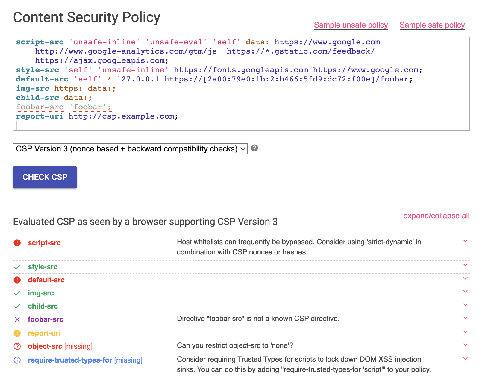

# XSS 的第二道防線：CSP

XSS 的第一道防線就是把使用者的輸入處理乾淨，確保內容是沒有問題的。但說起來容易，做起來難，尤其是對一些 legacy 的專案來講，程式碼又亂又雜又多，要修哪裡都不知道。

再者，寫程式時也可能會失誤，通常會發生資安問題有三種原因：

1. 你不知道這樣做會出事
2. 你忘記這樣做會出事
3. 你知道這樣做會出事，但因為各種原因決定不管它

第一種就像是前面一再提到的 `<a href>` 的例子，你可能不知道這裡面能放 `javascript:` 來執行程式碼。

第二種像是你知道 XSS 漏洞，你知道輸出應該要先做編碼，但你忘了。

第三種則是你擺明知道這邊沒編碼會有洞，而且應該要編碼，但因為專案的時程壓力或是老闆的指示所以不管它。

像是第一種的例子，你根本不知道那邊要做處理，不知道這樣會有漏洞，那該怎麼防禦？這就是為什麼我們需要第二道防線的理由之一。

## 自動防禦機制：Content Security Policy

CSP，全名為 Content Security Policy，可以翻作「內容安全政策」，意思就是你可以幫自己的網頁訂立一些規範，跟瀏覽器說我的網頁只允許符合這個規則的內容，不符合的都幫我擋掉。

想要幫網頁加上 CSP 有兩種方式，一種是經由 HTTP response header `Content-Security-Policy`，另外一種是經由 `<meta>` 標籤，因為後者比較容易示範，我們先以後者為主（但實際上比較常用的是前者，因為有些規則只能透過前者來設定）。

（其實還有神秘的第三種，`<iframe>` 的 csp 屬性，但那個又是別的議題，我們不會講到）

直接來看個範例：

``` html
<!DOCTYPE html>
<html>
<head>
  <meta http-equiv="Content-Security-Policy" content="script-src 'none'">
</head>
<body>
  <script>alert(1)</script>
  CSP test
</body>
</html>
```

在上面的網頁中，宣告了 CSP 為 `script-src 'none'`，意思就是：「這網頁不允許任何 script 的執行」，所以 body 中的 script 最後不會執行，如果打開 DevTools 的話會看到錯誤訊息：

> Refused to execute inline script because it violates the following Content Security Policy directive: "script-src 'none'". Either the 'unsafe-inline' keyword, a hash ('sha256-bhHHL3z2vDgxUt0W3dWQOrprscmda2Y5pLsLg4GF+pI='), or a nonce ('nonce-...') is required to enable inline execution.

這就是為什麼我把 CSP 稱作是第二道防線，當你的第一道防線（處理使用者輸入）失效時，還可以靠著 CSP 阻止 script 或其他資源的載入，一樣可以及時防止 XSS 漏洞。

## CSP 的規則

CSP 可以定義的東西就是：指示（directive）加上規則，像剛剛就是指示 `script-src` 配上規則 `'none'`，最終的結果就是阻止任何 JavaScript 的執行。

先提醒一點，這邊的指示 `script-src` 不能輕易解讀為「script 標籤的 src」，這裡的 script 代表的就是一般的「腳本」的意思，不是專指 script 標籤，也不是專指 src 屬性。

舉例來說，假設頁面上有 `<a href="javascript:alert(1)">click</a>`，這一段 HTML 沒有 script 標籤也沒有 src，點下去之後依然會被 CSP 阻擋並出現錯誤訊息，因為 `script-src 'none'` 的意思就是：「阻止任何 JavaScript 的執行」，無論是用 script 標籤、event handler 還是 javascript: 偽協議，結果都是一樣的。

那指示有哪些呢？

最重要的一個叫做 `default-src`，就是預設的規則，例如說沒有設置 `script-src`，那就會用 `default-src` 的內容，但要注意的是有幾種指示不會 fallback 到 `default-src`，如 `base-uri` 或是 `form-action` 等等，完整列表可以看這邊：[The default-src Directive](https://content-security-policy.com/default-src/)

其他的指示大概有以下幾種（我會省略一些不常用到的）：

1. `script-src`：管理 JavaScript
2. `style-src`：管理 CSS
3. `font-src`：管理字體
4. `img-src`：管理圖片
5. `connect-src`：管理連線（fetch、XMLHttpRequest 以及 WebSocket 等等）
6. `media-src`：管理 video 跟 audio 等等
7. `frame-src`：管理 frame 以及 iframe 等等
8. `base-uri`：管理 `<base>` 的使用
9. `form-action`：管理表單的 action
10. `frame-ancestors`：管理頁面可以被誰嵌入
11. `report-uri`：待會再講
12. `navigate-to`：管理頁面可以跳轉到的地方

是不是很多種？而且這個列表是會變化的，例如說最後的 `navigate-to` 就是比較新的東西，目前的瀏覽器都還沒有支援。

除了這些其實還有滿多個，但比較不常用的我就沒有特別寫了，有興趣的可以到 [MDN: Content-Security-Policy](https://developer.mozilla.org/en-US/docs/Web/HTTP/Headers/Content-Security-Policy) 或是 [Content Security Policy Reference](https://content-security-policy.com/) 去看。

那這每一個可以搭配的規則又有哪些呢？根據指示的不同，也會有不同的規則可以使用。

基本上常見的規則有以下幾種：

1. `*`，允許除了 `data:` 跟 `blob:` 還有 `filesystem:` 以外所有的 URL
2. `'none'`，什麼都不允許
3. `'self'`，只允許 same-origin 的資源
4. `https:`，允許所有 HTTPS 的資源
5. `example.com`，允許特定 domain（HTTP 跟 HTTPS 都可以）
6. `https://example.com`，允許特定 origin（只允許 HTTPS）

例如說 `script-src *` 基本上有設跟沒設差不多，而 `script-src 'none'` 直接不讓你執行任何的 JavaScript。

另外，有些規則是可以疊加的，以實務上來說很常會看見這樣的規則：

```
script-src 'self' cdn.example.com www.google-analytics.com *.facebook.net
```

有時候 script 會放在 same-origin，所以需要 `self`，有些會放在 CDN，所以需要 `cdn.example.com`，而因為有裝 Google Analytics 跟 Facebook SDK，所以要 `www.google-analytics.com *.facebook.net`，才能載入他們的 JavaScript。

完整的 CSP 就是這些東西的組合，指示之間用 `;` 隔開，像是這樣：

```
default-src 'none'; script-src 'self' cdn.example.com www.google-analytics.com *.facebook.net; img-src *;
```

透過 CSP，我們可以告訴瀏覽器說哪些資源允許載入，哪些不行，讓攻擊者就算找到了注入點，也不一定能執行 JavaScript，就不是一個 XSS 漏洞了，能夠降低影響力（但當然還是要修啦，只是風險比較小）。

## script-src 的規則

除了可以規範載入資源的 URL 以外，還有其他的規則可以使用。

例如說設置了 CSP 以後，預設是禁止 inline script 還有 `eval` 的，這裡被封鎖的 inline script 包括：

1. `<script>` 標籤裡面直接放程式碼（應該要用 `<script src>` 從外部引入）
2. `onclick` 這種寫在 HTML 裡面的 event handler
3. `javascript:` 偽協議

要使用 inline script 的話，需要加上 `'unsafe-inline'` 這個規則。

而若是要像 `eval` 那樣，把字串當成程式碼來執行，則是要加上 `'unsafe-eval'` 這個規則。有些人可能知道 `setTimeout` 其實也可以把字串拿來當程式碼執行，像這樣：

``` js
setTimeout('alert(1)')
```

還有 `setInterval` 跟 `Function` 等等，也都可以做到一樣的事情，這些都需要加上 `'unsafe-eval'` 才能使用。

除了這些之外，還有 `'nonce-xxx'`，意思是在後端產生一個隨機字串，例如說 `a2b5zsa19c` 好了，那有帶上 `nonce=a2b5zsa19c` 的 script 標籤就可以載入：

```html
<!-- 允許 -->
<script nonce=a2b5zsa19c>
  alert(1)
</script>

<!-- 不允許 -->
<script>
  alert(1)
</script>
```

還有類似的 `'sha256-abc...'`，意思是允許特定 hash 的 inline script，例如說 `alert(1)` 拿去做 sha256 之後會得到一個 binary 的值，base64 過後會是 `bhHHL3z2vDgxUt0W3dWQOrprscmda2Y5pLsLg4GF+pI=`，因此底下範例中只有內容剛好是 `alert(1)` 的 script 會載入，其他都不會：

 ```html
<!DOCTYPE html>
<html>
<head>
  <meta http-equiv="Content-Security-Policy" content="script-src 'sha256-bhHHL3z2vDgxUt0W3dWQOrprscmda2Y5pLsLg4GF+pI='">
</head>
<body>
  <!-- 允許 -->
  <script>alert(1)</script>

  <!-- 不允許 -->
  <script>alert(2)</script>

  <!-- 多一個空格也不允許，因為 hash 值不同 -->
  <script>alert(1) </script>
</body>
</html>
```

最後還有一個也可能會用到的是 `'strict-dynamic'`，意思就是：「符合規則的 script 可以載入其他 script 而不受 CSP 限制」，像這樣：

``` html
<!DOCTYPE html>
<html>
<head>
  <meta http-equiv="Content-Security-Policy" content="script-src 'nonce-rjg103rj1298e' 'strict-dynamic'">
</head>
<body>
  <script nonce=rjg103rj1298e>
    const element = document.createElement('script')
    element.src = 'https://example.com'
    document.body.appendChild(element)
  </script>
</body>
</html>
```

在我們設置的 CSP 中，只有 `nonce-rjg103rj1298e` 是允許的 script，並沒有允許其他來源，但是從 `<script nonce=rjg103rj1298e>` 裡面新增的 script 不受限制，可以動態新增其他來源的 script，這就是 `'strict-dynamic'` 的功用。

## 怎麼決定 CSP 規則要有哪些？

在設置 CSP 的時候，通常都以 `default-src 'self'` 起手，預設 same-origin 的資源都是可以載入的。

接著先來處理最重要的 script，通常最優先的事項是最好不要有 `'unsafe-inline'` 跟 `'unsafe-eval'`，因為有了這兩個以後，有設跟沒設的差別就不大了。

我們加上 CSP 的初衷是什麼？想要當成 XSS 的第二道防線，但如果加上了 `unsafe-inline`，就親手瓦解了這道防線，只要隨便插入一個 `<svg onload=alert(1)>` 就可以執行程式碼。

不過現實生活沒有這麼美好，通常都會有一些以前的 inline script，讓我們不得不加上 `unsafe-inline`，這邊教大家一個常見的處理方式。例如說 Google Analytics 好了，會要你在網頁上加入底下的程式碼：

``` html
<script async src="https://www.googletagmanager.com/gtag/js?id=UA-XXXXXXXX-X"></script>
<script>
  window.dataLayer = window.dataLayer || [];
  function gtag(){dataLayer.push(arguments);}
  gtag('js', new Date());

  gtag('config', 'UA-XXXXXXXX-X');
</script>
```

這就是我們最想避免的 inline script，那該怎麼做呢？在 Google 所提供的官方文件：[使用代碼管理工具搭配內容安全政策](https://developers.google.com/tag-platform/tag-manager/csp?hl=zh-tw)中就有提及，我們剛剛其實也有講到，兩種解法：

1. 幫那一段 script 加上 nonce
2. 算出那段 script 的 hash 並加上 `sha256-xxx` 的規則

這兩種解法都可以執行特定的 inline script，而不是依靠權限全開的 `'unsafe-inline'`。除此之外，官方文件也有提醒如果要使用「自訂 JavaScript 變數」的功能，必須要打開 `'unsafe-eval'` 才有用。

如果你不確定你設置的 CSP 是否安全，可以到這一個 Google 提供的網站：[CSP Evaluator](https://csp-evaluator.withgoogle.com/)，它會偵測你的 CSP 是否有錯誤，以及是不是安全，如下圖所示：



雖然前面有提到沒設好的 CSP 跟沒設差不多，但當然還是有設定會比較好，畢竟跨出了第一步嘛，有很多公司以前可能連有 CSP 這種東西都不知道，有加了就值得鼓勵，之後再慢慢改進就好。

文章前半段有提到一個「report-uri」的指示，這是個非常貼心的功能。CSP 如果沒設好的話，很有可能會阻擋正常的資源，導致網站無法正常使用或是部分功能壞掉，這就得不償失了。

因此，有另一個叫做 `Content-Security-Policy-Report-Only` 的 header，意思就是你可以設定 CSP，但是不會真的阻擋，只會在載入違反規則的資源時送一個報告到指定的 URL。

透過這個功能，我們就可以先觀察有哪些違反 CSP 的狀況發生，從這些 log 中看看有沒有沒設定好的 CSP，確認都沒問題之後才改用 `Content-Security-Policy`。

## 別人的 CSP 是怎麼設定的

你有看過什麼是一大串 CSP 嗎？

來看一下 GitHub 首頁的 CSP，讓大家體會什麼是一大串：

```
default-src
  'none';
base-uri
  'self'; 
child-src
  github.com/assets-cdn/worker/
  gist.github.com/assets-cdn/worker/;
connect-src
  'self'
  uploads.github.com
  objects-origin.githubusercontent.com
  www.githubstatus.com
  collector.github.com
  raw.githubusercontent.com
  api.github.com
  github-cloud.s3.amazonaws.com
  github-production-repository-file-5c1aeb.s3.amazonaws.com
  github-production-upload-manifest-file-7fdce7.s3.amazonaws.com
  github-production-user-asset-6210df.s3.amazonaws.com
  cdn.optimizely.com
  logx.optimizely.com/v1/events
  *.actions.githubusercontent.com
  productionresultssa0.blob.core.windows.net/
  productionresultssa1.blob.core.windows.net/
  productionresultssa2.blob.core.windows.net/
  productionresultssa3.blob.core.windows.net/
  productionresultssa4.blob.core.windows.net/
  wss://*.actions.githubusercontent.com
  github-production-repository-image-32fea6.s3.amazonaws.com
  github-production-release-asset-2e65be.s3.amazonaws.com
  insights.github.com
  wss://alive.github.com github.githubassets.com; 
font-src
  github.githubassets.com;
form-action
  'self'
  github.com
  gist.github.com
  objects-origin.githubusercontent.com;
frame-ancestors
  'none';
frame-src
  viewscreen.githubusercontent.com
  notebooks.githubusercontent.com;
img-src
  'self'
  data:
  github.githubassets.com
  media.githubusercontent.com
  camo.githubusercontent.com
  identicons.github.com
  avatars.githubusercontent.com
  github-cloud.s3.amazonaws.com
  objects.githubusercontent.com
  objects-origin.githubusercontent.com
  secured-user-images.githubusercontent.com/
  user-images.githubusercontent.com/
  private-user-images.githubusercontent.com
  opengraph.githubassets.com
  github-production-user-asset-6210df.s3.amazonaws.com
  customer-stories-feed.github.com
  spotlights-feed.github.com
  *.githubusercontent.com;
manifest-src
  'self';
media-src
  github.com
  user-images.githubusercontent.com/
  secured-user-images.githubusercontent.com/
  private-user-images.githubusercontent.com
  github.githubassets.com;
script-src
  github.githubassets.com;
style-src
  'unsafe-inline'
  github.githubassets.com;
upgrade-insecure-requests;
worker-src
  github.com/assets-cdn/worker/
  gist.github.com/assets-cdn/worker/
```

基本上各種能設定的都設定了，而我們最關注的 script，只設定了 `github.githubassets.com;`，是滿安全的設定方式。

而且 GitHub 的賞金計畫中有一個特殊的類別叫做 [GitHub CSP](https://bounty.github.com/targets/csp.html)，只要你可以繞過 CSP 並且執行程式碼，就算你沒有找到可以注入 HTML 的地方也算數。

接著看一下 Facebook：

```
default-src
  *
  data:
  blob:
  'self'
  'wasm-unsafe-eval'
script-src
  *.facebook.com
  *.fbcdn.net
  *.facebook.net
  *.google-analytics.com
  *.google.com
  127.0.0.1:*
  'unsafe-inline'
  blob:
  data:
  'self'
  'wasm-unsafe-eval'
style-src
  data:
  blob:
  'unsafe-inline'
  *
connect-src
  secure.facebook.com
  dashi.facebook.com
  dashi-pc.facebook.com
  graph-video.facebook.com
  streaming-graph.facebook.com
  z-m-graph.facebook.com
  z-p3-graph.facebook.com
  z-p4-graph.facebook.com
  rupload.facebook.com
  upload.facebook.com
  vupload-edge.facebook.com
  vupload2.facebook.com
  z-p3-upload.facebook.com
  z-upload.facebook.com
  graph.facebook.com
  'self'
  *.fbcdn.net
  wss://*.fbcdn.net
  attachment.fbsbx.com
  blob:
  data:
  *.cdninstagram.com
  *.up.facebook.com
  wss://edge-chat-latest.facebook.com
  wss://edge-chat.facebook.com
  edge-chat.facebook.com
  edge-chat-latest.facebook.com
  wss://gateway.facebook.com
  *.facebook.com/rsrc.php/
  https://api.mapbox.com
  https://*.tiles.mapbox.com
block-all-mixed-content
upgrade-insecure-requests;
```

雖然也是一大串，但可以注意到 script 有開了 `'unsafe-inline'`，是比較不安全的做法，如果把這串 CSP 貼到前面講的 CSP Evaluator，也是跳一堆紅字出來：


## 小結

我自己其實滿推薦大家設定 CSP 的，只要設定了以後，就多了一道防線，這樣在問題發生時至少還有機會挽救，透過 CSP 阻擋攻擊者的 XSS payload，讓損害降到最低。

而且門檻不高，可以先從 report only 開始，邊觀察邊調整網站的 CSP 規則，確定不會影響到一般使用者以後再正式上線。

最後一樣來個小測驗，在之後的文章會解答。

小明看完這篇之後回頭看了一下自己的專案，發現 JavaScript 的檔案都來自於 `https://unpkg.com` 上的套件，因此加上了如下的 CSP，請問 `script-src` 的部分有什麼問題？

```
Content-Security-Policy: script-src https://unpkg.com;
```
