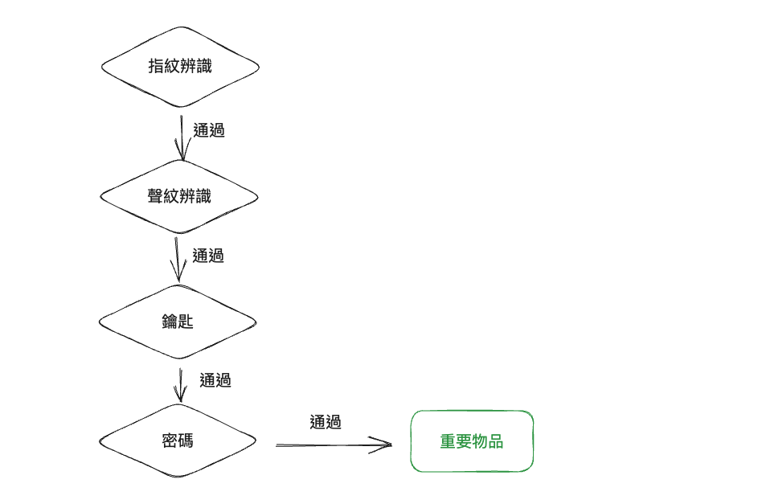
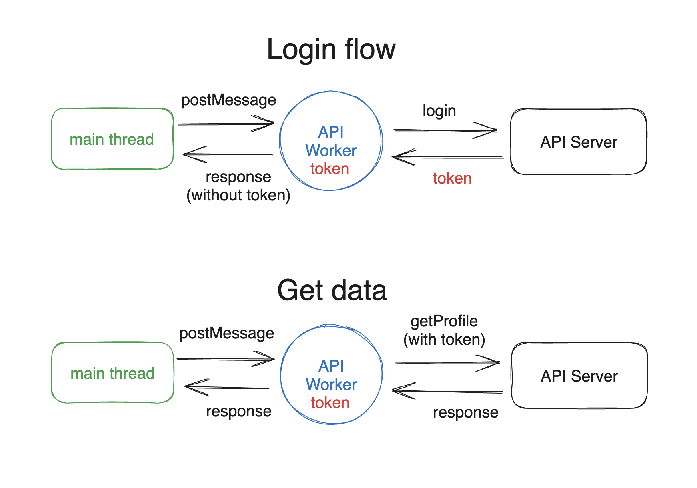

# XSS 的第三道防線：降低影響範圍

在第一道防線中，我們對使用者的輸入做了處理，盡可能確保使用者的輸入有經過編碼或是消毒，不要讓他們插入惡意的內容，而第二道防線則是 CSP，靠著 CSP 的規則，讓有心人士就算真的插入惡意的內容，也無法執行 JavaScript 以及載入其他資源，就沒辦法達到攻擊的目的。

而這篇要講的第三道防線，便是假設 XSS 的必然發生，根據這點來擬定防護策略。

有些人可能會疑惑說為什麼要這樣做？不是把前兩道防線做好，照理來說就可以防禦了嗎？那怎麼又會假設 XSS 發生來制定策略呢？這豈不是本末倒置？

我舉個例子，大家應該有看過《不可能的任務》或是類似的電影吧？裡面通常都會有需要去偷東西的情節，而保存貴重物品的地方一定是設計了層層關卡，既要視網膜辨識、臉部辨識、聲紋辨識，還要來個走路姿勢的辨識，過了這關以後還需要有金庫大門的鑰匙，大門進去之後可能還有個保險箱，最後還要知道另外一組密碼才能打開保險箱，最後才能拿到東西。



需要層層關卡的原因很簡單，就是為了增加安全性，雖然有些設計看起來已經很安全了，但你永遠無法保證它不會被攻破，因此才需要多加一層或是多層保障，做到「只有每一層都被攻破，才會受到損害」，以增加攻擊者的成本。

資安的防護也是這樣一層一層的，就算徹底檢查過一遍後端的程式碼，確保了每個地方都有做好驗證跟編碼，也無法保證前端永遠不會被 XSS，因為之後的新人有可能犯錯，寫了不安全的程式碼，而第三方函式庫也有可能會有 0-day，或是有人夾帶惡意程式碼，直接從原始碼偷偷塞入程式碼去發起攻擊，這些都是有可能的。

因此加上了 CSP，至少能夠確保儘管第一層被入侵了，還有第二層能夠阻擋攻擊，讓攻擊者無法載入外部資源，或者是無法把資料傳出去。當然，第二層也不是絕對安全的，我們在之後的篇章就會看到一些繞過 CSP 規則的手法，讓 CSP 形同虛設。

當我們盡可能做好所有 XSS 的防護以後，第三層就是反過來，「假設 XSS 必然發生，那我們能做什麼降低損害？」，如此一來就能多增加一層安全性，就算 XSS 真的發生了，也不至於造成最嚴重的影響。

先聲明一下，每間公司、每個產品都應該依照自己的資安需求選擇適合的防護，講得更專業一點就是風險胃納（Risk appetite），你願意接受多少的風險？

雖然說每加一層就是增加了多一點安全性，但同時也會增加成本跟複雜度，並不是每個產品都需要這麼嚴密的防護。舉例來說，我的部落格網站就算被 XSS 了影響也不大，所以根本不需要 CSP，也不需要去思考被 XSS 以後怎麼降低損害。

反之，加密貨幣的交易所如果冷錢包被偷走或是損壞，可能損失極大，因此通常會做一系列的風險控管措施，像是冷錢包本身的儲存裝置經過高強度的加密，而且放在防水防火的保險箱中，這個保險箱又放在一個有 24 小時監控的房間，房間本身需要指紋辨識跟鑰匙才能進入等等。

知道有哪些層次的好處在於當有需要的時候，你可以立刻知道有哪些解決方案可以挑選，以及這些方案的成本與帶來的效益為何，擁有越多資訊，越能知道是不是該導入或是不導入這些方案。

在開始探討第三層的防護以前，我們得先知道攻擊者找到 XSS 以後可以幹嘛。

當攻擊者找到 XSS 漏洞以後，就可以在「使用者開啟某個頁面時」，在該頁面執行 JavaScript 程式碼。因此最常見的可能是去偷用來驗證身份的 token，或者是直接呼叫 API，進行一些危險的操作，像是改密碼或是轉帳等等的，再來就是偷一些資料，比如說個人身份資料啦或是交易紀錄啦等等。

因此，如果要降低被 XSS 後的影響，就是要想辦法減少攻擊者可以做的事情。

## 第一招：最有效的解法 - 多重驗證

為什麼 XSS 之後攻擊者可以取得資料或是進行操作？因為網站的後端會認為現在這個請求是合法的，是本人發出的，或是講得更技術一點，收到的請求中有可以驗證身份的 token，信任了這個請求，所以才執行操作。

因此最有效的解法之一就是引入多重驗證，讓伺服器除了 token 以外還要求了其他只有本人才知道的資訊，藉此降低危害。

舉例來說，在網路銀行轉帳的時候填完金額跟地址，最後不是都會再過一道手續嗎？輸入自己之前定義好的網銀密碼或者是收手機簡訊等等，就是為了確保多一道安全手續。舉例來說，如果某網銀有一個 XSS，攻擊者可以在網銀頁面執行任意程式碼，假設沒有多一道安全手續，可能攻擊者只要打一個 `/transfer` 的 API，你的錢就被轉走了。

但多一道手續以後，`/transfer` 的參數之一會是手機簡訊，攻擊者不知道手機簡訊的驗證碼，因此沒辦法成功呼叫 API，自然而然也就偷不到錢。

所以你會發現這種重大操作通常都會再過一層手續，例如說修改密碼要輸入現在的密碼，或是轉帳要收手機簡訊等等，都是類似的概念。

而且除了 XSS 以外，同時也確保了「就算有人實體接觸到你的電腦，也沒辦法做壞事」，從這點就可以看出安全性提升了不少。而通常安全性跟使用者體驗是成反比的，安全性愈高，體驗就愈差，因為你要做的事情就愈多，這點是避免不了的。

例如說最安全的做法就是每打一隻 API 都要你收一封新的簡訊，那就很安全，但同時體驗也超差。因此在實際的狀況裡，大多數都只有重大操作會需要第二種驗證方式，其他拿資料的 API 都不需要，例如說獲取交易紀錄或是使用者資料等等，都不會額外做保護。

## 第二招：不讓 token 被偷走

剛剛有提過最常見的方式就是攻擊後把 token 偷走，我這邊指的 token 並沒有指涉特定技術，它可以是 session ID，可以是 JWT token，也可以是 OAuth token，總之就當成是一個「可以驗證身份的東西」就好了。

因此，如果 token 被偷走了，使用者就可以自己拿你的 token 去發請求給後端 API，不需要侷限在瀏覽器裡面。

有些人會覺得：「有沒有偷到 token 有差嗎？還不都可以代替使用者執行操作？」，舉個例子，假設 token 的儲存方式是 HttpOnly 的 cookie，因此能確保使用 JavaScript 拿不到 cookie，但攻擊者用 `fetch('/api/me')` 的時候一樣可以取得個人資料，因為在送出請求時 cookie 會自動被帶上。

這點是正確的，但雖然看起來沒什麼差，攻擊者一樣可以做到很多事情，不過還是有一些細微的差異。

第一個差異是「會不會被網站限制住」。

如果拿到 token，可以把 token 回傳以後在任何地方對後端發 request，
但如果拿不到，就只能在 XSS 的攻擊點執行惡意程式碼。這時候就有可能會有一些限制，例如說 payload 字數上的限制之類的，或者是同源政策的限制。

舉例來說，假設有兩個網站 `a.huli.tw` 跟 `b.huli.tw`，它們都用寫在 `huli.tw` 的 cookie 來做驗證。

接著攻擊者成功在 `a.huli.tw` 找到 XSS，可是使用者資料卻是在 `b.huli.tw`，這時候在 a 就沒有辦法拿到使用者的資料，因為 `fetch` 會被同源政策擋下。可是如果兩個服務都用同一個 token 而且存在 `localStorage` 裡面，那攻擊者就可以拿這 token 去存取 b，然後順利取得使用者資料。

第二個差異則是「會不會有時間限制」，如果拿到了 token，基本上只要 token 不過期，都可以在自己的電腦上以使用者的身份去發出請求。

可是如果只能用 XSS，就表示只有使用者開啟網頁的時間你能夠執行攻擊，只要使用者把網頁或是瀏覽器關掉，就不能再執行 JavaScript 程式碼了。

所以，如果可以的話，token 不要被直接拿走顯然是最好的，會讓攻擊者可以發起的攻擊更侷限一點。

而以目前前端的機制來說，唯一能保證 token 不被 JavaScript 碰到的，就是 HttpOnly 的 cookie 了（這邊不考慮瀏覽器本身有漏洞這件事，不在討論範圍，也不考慮有 API 會直接回傳 token），除此之外沒有其他選擇。

但如果你的需求是「只想要讓部分 JavaScript 拿到 token」的話，還有另外一種解決方案，但需要注意的是這個解法儲存的 token 並不能持久化，只要使用者重新整理以後，token 就會不見了。

這個解法很簡單，就是存在 JavaScript 的變數裡面，而且用 closure 把變數包住，確保外界存取不到，像是這樣：

``` js
const API = (function() {
  let token
  return {
    login(username, password) {
      fetch('/api/login', {
        method: 'POST',
        body: JSON.stringify({ username, password })
      }).then(res => res.json())
      .then(data => token = data.token)
    },

    async getProfile() {
      return fetch('/api/me', {
        headers: {
          'Authorization': 'Bearer ' + token
        }
      })
    }
  }
})()

// 使用的時候
API.login()
API.getProfile()
```

如此一來，就算攻擊者找到了 XSS，也會因為 scope 的關係沒辦法「直接」存取到 `token` 這個變數。會把「直接」這兩個字標起來，是因為攻擊者有了 XSS 之後可以幹很多邪惡的事情，像是這樣：

``` js
window.fetch = function(path, options) {
  console.log(options?.headers?.Authorization)
}
API.getProfile()
```

透過把 `window.fetch` 的實作抽換掉，就能夠攔截到傳入函式的參數，並且間接地存取到 `token`。

因此，更安全的方法是不讓 XSS 去干擾具有 token 的執行環境，做到 context isolation，這在網頁前端可以透過 Web Workers 完成，藉由 Web Workers，可以建立一個新的執行環境，藉此隔離開來，如下圖：



大概的程式碼如下（只是依照概念稍微寫一下，沒有實際跑過）：

``` js
// worker.js
let token
async function login({ username, password }) {
  return fetch('/api/login', {
    method: 'POST',
    body: JSON.stringify({ username, password })
  }).then(res => res.json())
  .then(data => {
    // 讓 token 不要回傳
    const { token, ...props } = data
    token = data.token
    return props
  })
}

async function getProfile() {
  return fetch('/api/me', {
    headers: {
      'Authorization': 'Bearer ' + token
    }
  })
}

onmessage = async function(e) {
  const { name, params } = e.data
  let response
  if (name === 'login') {
    response = await login(params)
    
  } else if (name === 'getProfile') {
    response = await getProfile()
  }

  postMessage({
    name,
    response
  })
}
```

而應用程式裡面的程式碼就是去初始化 worker，並且呼叫 API：

``` js
const apiWorker = new Worker("worker.js");

async function login(params) {
  return new Promise(resolve => {
    apiWorker.postMessage({
      name: 'login',
      params: {
        username,
        password
      }
    })

    apiWorker.onmessage = (e) => {
      const { name, response } = e.data
      if (name === 'login') {
        resolve(e.response)
      }
    }
  })
}

login({
  username: 'test',
  password: 'test'
})
```

其實說穿了就是把 API 的網路請求都放在 worker 裡面，因為執行環境隔離的關係，所以除非是 worker 裡面有 XSS，否則從 main thread 是無法干擾到 worker 的，沒辦法拿到裡面的資料，因此就能保證 token 的安全性。

不過這個解法很明顯會增加不少開發成本，因為有很多東西需要調整。如果你對這個解法的更多細節以及優缺點有興趣，日本二手商品交易平台 Mercari 就是用這個解法，可以參考他們的技術部落格：[Building secure web apps using Web Workers](https://engineering.mercari.com/en/blog/entry/20220930-building-secure-apps-using-web-workers/)

以 token 的儲存來說，若是需要在 JavaScript 裡面拿到 token，而且不需要持久化的話，這個選擇大概是最佳解了，專門做身份驗證的公司 Auth0 也有寫了一篇來探討 token 的儲存，可以參考：[Auth0 docs - Token Storage](https://auth0.com/docs/secure/security-guidance/data-security/token-storage)

## 第三招：限制 API 的呼叫

剛才有提過就算 token 不被偷走，攻擊者一樣可以透過 XSS 來呼叫 API 並拿到回應，這個結論對於使用 cookie 來儲存 token 是成立的。

但如果是使用上面說的，用 Web Workers 加上變數來儲存 token 的話，狀況就不一樣了。使用了這個方法就代表攻擊者自己用 `fetch()` 呼叫 API 是沒有用的，因為不會有任何 token 附加在請求上面，所以伺服器的身份驗證就不會通過。

就如同上面給的範例一樣，所有的 API 請求都要通過 Web Workers，相當於是在 worker 這一層做了一個前端的 proxy。因此，就算 XSS 後可以拿到 `apiWorker`，也只能呼叫 `apiWorker` 有實作的 API，其他的都沒辦法呼叫。

舉個例子，假設現在後端 API 伺服器有實作一個 `/uploadFile` 的功能，但是這個功能是給內部後台用的，所以前端在 worker 裡面並沒有實作，這時候攻擊者無論如何都沒有辦法使用到這個功能，多增加了一層防護。

## 第四招：限制 token 的權限

跟制定 XSS 的防禦策略時一樣，盡可能確保不被 XSS 以後，最後一道防線是要假設 XSS 會發生，那還有什麼可以做的，來降低損害。因此這邊最後一招是假設 token 一定會被利用，那還能做些什麼。

最直覺能想到的當然就是限制 token 的權限，讓這個 token 不能做到太多事情。當然，後端的存取控制是一定要做的，但前端也可以再多做一些事情。

舉例來說，假設有個餐廳訂位系統，後端 API 就是一整包，無論是訂餐廳的還是給內部後台用的，都是同一個 API 伺服器，例如說 `/users/me` 就是拿到自己的資料，`/internal/users` 就是拿到所有使用者資料等等（會檢查權限）。

假設 XSS 發生在訂餐廳的網站，而被攻擊的對象又是有權限的內部員工，那攻擊者就可以呼叫 `/internal/users` 來拿到所有使用者的資料。最理想的方式應該是從後端 API 那邊去改，把內部系統跟餐廳訂位系統切開，不要共用同一組資料，但有可能這個改動需要的時間太多，成本太高。

此時，就可以使用另外一種解法，叫做 Backend For Frontend，簡稱 BFF，亦即專門給前端使用的後端伺服器，所有前端的請求都會先通過 BFF，如下圖所示：


因此前端拿到的 token 也只是跟 BFF 溝通的 token，並不是 BFF 後面那台後端伺服器的 token。如此一來，就可以在 BFF 這一端限制存取權限，直接封鎖所有前往 `/internal` 的請求，就能限制前端拿到的 token 的權限，確保內部所使用的 API 不會被呼叫到。

## 結語

「防止 XSS」這個是一定要做的，但這僅僅只是第一道防線而已，如果只有做這個，就代表防禦是 0 跟 1，要嘛防得很好全都防住了，要嘛只要一個地方沒防好，就跟沒防一樣，直接被攻破大門。

這就是為什麼我們需要第二層甚至第三層防線，因為會讓防禦變得更有深度，就算哪邊真的忘記過濾使用者輸入，還有 CSP 擋著，讓攻擊者無法執行 JavaScript；就算 CSP 也被繞過了，至少執行不了轉帳功能，因為要輸入手機驗證碼。

愈多道防線代表愈高的安全性，同時也代表著愈高的成本與系統複雜度，了解有哪些手段可以防禦是很重要的，但不代表每個產品都需要這些東西。對大多數的網站來說，可能有前兩道防線就足夠了。

原本我對這個主題其實理解的不夠深入，是剛好在臉書社團 Front-End Developers Taiwan 有人討論起了這個話題，我才對這個主題有比較深刻的理解，也順勢加到了這次的系列文裡面。

特別感謝討論串中 Ho Hong Yip 提供的 Auth0 參考資料以及証寓提供的多個連結，還有與我的技術討論，都讓我把這個問題想得更清楚了一些（但或許還不夠清楚，歡迎留言交流）。

參考資料：

1. [臉書社團 Front-End Developers Taiwan 討論串](https://www.facebook.com/groups/f2e.tw/posts/6432399706797340/)
2. [auth0 - Token Storage](https://auth0.com/docs/secure/security-guidance/data-security/token-storage)
3. [Building secure web apps using Web Workers](https://engineering.mercari.com/en/blog/entry/20220930-building-secure-apps-using-web-workers/)
4. [Why is BFF pattern deemed safer for SPA's?](https://stackoverflow.com/questions/73096336/why-is-bff-pattern-deemed-safer-for-spas)
