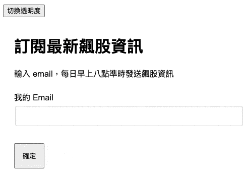

# 你的畫面不是你的畫面：Clickjacking 點擊劫持

這是第五章「其他有趣的前端資安主題」的開頭，在最後這一個章節裡面，會介紹一些比較難分到前面類別的資安主題，講的內容會更廣泛一點。

首先，第一個我們要來看的是 clickjacking，中文翻作點擊劫持，意思是你以為點的是 A 網站的東西，事實上點的就是 B 網站，你的點擊從 A 網站被「劫持」到了 B 網站。

只是一個點擊而已，這樣會有什麼危害嗎？

假設在背後的是一個銀行轉帳頁面，而且帳號跟金額都填好了，只要按一個按鈕就會轉錢出去，這樣的話危害就很大了（這只是舉例而已，不過從這個案例就能知道為什麼轉帳需要第二層驗證了）。

或是舉個更常見的例子，例如說有個乍看之下是取消訂閱電子報的頁面，於是你點了「確定取消」的按鈕，但其實底下藏著的是 Facebook 的按讚鈕，所以你不但沒有取消訂閱，還被騙了一個讚，像這種騙讚的攻擊又稱為 likejacking。

接著，就讓我們一起更了解這個攻擊方式吧！

## Clickjacking 攻擊原理

Clickjacking 的原理就是把兩個網頁疊在一起，透過 CSS 讓使用者看見的是 A 網頁，但點到的卻是 B 網頁。

以比較技術的講法來說，就是用 iframe 把 B 網頁嵌入然後設透明度 0.001，再用 CSS 把自己的內容疊上去，就大功告成了。

我覺得 clickjacking 直接看範例是最有趣而且最直接的，可以參考底下的 GIF：


我以為我點了「確定取消」，但實際上點到的卻是「刪除帳號」，這就是 clickjacking。如果想要親自體驗的，可以到這個網頁玩：[clickjacking 範例](https://aszx87410.github.io/demo/clickjacking/)。

有些人可能會覺得這個範例太過簡單，實際應用中可能很少出現這種這麼簡單的攻擊，只需要按一個按鈕而已。或許更多網站會更複雜一點，例如說要先輸入一些資訊？

底下這個範例以「更改 email」這個功能來設計 clickjacking，比起前一個範例是整個網頁蓋過去，這個範例刻意留下原網頁的 input，其他都用 CSS 蓋掉，按鈕的部分用 `pointer-events:none` 讓事件穿透。

看似是一個輸入 email 訂閱資訊的網頁，但按下確定之後卻跳出「修改 email 成功」，因為背後其實是個修改 email 的網頁：



一樣有提供可以自己操作的網頁版：[進階 clickjacking 範例](https://aszx87410.github.io/demo/clickjacking/adv.html)。

點擊劫持這個攻擊手法的流程大概就是：

1. 把目標網頁嵌入惡意網頁之中（透過 iframe 或其他類似標籤）
2. 在惡意網頁上用 CSS 把目標網頁蓋住，讓使用者看不見
3. 誘導使用者前往惡意網頁並且做出操作（輸入或點擊等等）
4. 觸發目標網頁行為，達成攻擊

因此實際上攻擊的難易度，取決於惡意網站設計得怎麼樣，以及目標網頁的原始行為需要多少互動。舉例來說，點擊按鈕就比輸入資訊要容易得多。

然後還要提醒一點，這種攻擊要達成，使用者要先在目標網站是登入狀態才行。只要能把目標網頁嵌入惡意網頁之中，就會有 clickjacking 的風險。

## Clickjacking 的防禦方式

如同前面所述，只要能被其他網頁嵌入就會有風險，換句話說，如果沒辦法被嵌入，就不會有 clickjacking 的問題了，這就是從根本解決 clickjacking 的方式。

一般來說點擊劫持的防禦方式可以分為兩種，一種是自己用 JavaScript 檢查，另一種是透過 response header 告知瀏覽器這個網頁是否能被嵌入。

### Frame busting

有一種叫做 frame busting 的方式，就是我前面提到的自己用 JavaScript 檢查，原理很簡單，程式碼也很簡單：

``` js
if (top !== self) {
  top.location = self.location
}
```

每一個網頁都有自己的 window object，而 `window.self` 指向的會是自己的 window，那 `top` 的話就是 top window，可以想成是這整個瀏覽器的「分頁」最上層的 window。

如果今天是被獨立開啟的網頁，那 `top` 跟 `self` 就會指向同一個 window，但如果今天網頁是被嵌入在 iframe 裡面，`top` 指的就會是使用 iframe 的那個 window。

舉個例子好了，假設今天我在 localhost 有個 index.html，裡面寫著：

```html
<iframe src="https://example.com"></iframe>
<iframe src="https://huli.tw"></iframe>
```

那關係圖就會是這樣：


綠色跟黃色分別是兩個以 iframe 載入的網頁，也就是兩個不同的 window，在這兩個網頁裡面如果存取 `top` 的話，就會是 `localhost/index.html` 的 window object。

所以透過 `if (top !== self)` 的檢查，就可以知道自己是不是被放在 iframe 裡面。如果是的話，就改變 top.location，把最上層的網頁導向其他地方。

聽起來很美好而且沒什麼問題，但其實會被 iframe 的 `sandbox` 屬性繞過。這個屬性我們之前在「就算只有 HTML 也能攻擊？」那篇有提過了，再幫大家複習一下。

iframe 有一個屬性叫做 `sandbox`，代表這個 iframe 的功能受到限制，如果要把限制打開必須明確指定，可以指定的值有很多，我簡單列幾個：

1. `allow-forms`，允許提交表單
2. `allow-scripts`，允許執行 JS
3. `allow-top-navigation`，允許改變 top location
4. `allow-popups`，允許彈出視窗

也就是說，如果我是這樣載入 iframe 的：

``` html
<iframe src="./busting.html" sandbox="allow-forms">
```

那就算 busting.html 有上面我說的那個防護也沒有用，因為沒有 `allow-scripts` 所以不能執行 JavaScript，但 user 還是可以正常 submit 表單。

於是就有人提出了更實用的方法，在現有基礎上做一些改良（程式碼取自：[Wikipedia - Framekiller](https://en.wikipedia.org/wiki/Framekiller)）：

``` html
<style>html{display:none;}</style>
<script>
   if (self == top) {
       document.documentElement.style.display = 'block'; 
   } else {
       top.location = self.location; 
   }
</script>
```

先把網頁整個藏起來，一定要執行 JavaScript 才能開啟，所以用上面的 sandbox 阻止 script 執行的話，就只會看到一個空白的網頁；如果不用 sandbox 的話，JavaScript 的檢查不會過，所以還是看到一片空白。

雖然說這樣可以做到比較完全的防禦，但也有缺點存在。這個缺點就是，如果使用者主動把 JavaScript 功能關掉的話，就什麼都看不到了。所以對於把 JavaScript 功能關閉的使用者來說，體驗還滿差的。

在 2008 年 clickjacking 剛出來的時候，相關防禦方式還沒有這麼完整，所以只好用這些比較像是 workaround 的解法。而現在，瀏覽器已經支援了其他更好的方式來阻擋網頁被嵌入。

### X-Frame-Options

這個 HTTP response header 在 2009 年時首先由 IE8 實作，接著其他瀏覽器才跟上，在 2013 年時才變成了完整的 [RFC7034](https://www.rfc-editor.org/rfc/rfc7034.txt)。

這個 header 會有底下這三種值：

1. `DENY`
2. `SAMEORIGIN`
3. `ALLOW-FROM https://example.com/`

第一種就是拒絕任何網頁把這個網頁嵌入，包含 `<iframe>`、`<frame>`、`<object>`、`<applet>` 或是 `<embed>` 這些 tag 都不行。

第二個則是只有 same-origin 的網頁可以，最後一個則是只允許特定的 origin 嵌入，除此之外其他的都不行（只能放一個值不能放列表，所以如果要多個 origin，要像 CORS header 那樣在 server 動態調整輸出）。

在 RFC 裡面還有特別提到最後兩種的判定方式可能跟你想的不一樣，每個瀏覽器的實作會有差異。

例如說有些瀏覽器可能只檢查「上一層」跟「最上層」，而不是每一層都檢查。這個「層」是什麼意思呢？因為 iframe 理論上可以有無限多層嘛，A 嵌入 B 嵌入 C 嵌入 D，以此類推。

如果把這關係轉化為文字的話，會長得像這樣：

``` 
example.com/A.html
--> attacker.com
    --> example.com/B.html
        --> example.com/target.html
```

對於最內層的 target.html 來說，如果瀏覽器只檢查上一層（B.html）跟最上層（A.html）的話，那儘管設置成 `X-Frame-Options: SAMEORIGIN`，檢查還是會通過，因為這兩層確實是相同的 origin。但實際上，中間卻夾了一個惡意網頁在裡面，所以還是有被攻擊的風險。

除此之外 `X-Frame-Options` 還有第二個問題，就是 `ALLOW-FROM` 的支援度不好，一直到 2023 年的現在，主流瀏覽器都沒有支援 `ALLOW-FROM` 這個用法。

`X-Frame-Options` 最前面的 `X` 說明了它比較像是一個過渡時期的東西，因此在新的瀏覽器當中，它的功能已經被 CSP 給取代，並且解決了上面提到的問題。

### CSP: frame-ancestors

CSP 有一個指示是 `frame-ancestors`，設定起來會像這樣：

1. `frame-ancestors 'none'`
2. `frame-ancestors 'self'`
3. `frame-ancestors https://a.example.com https://b.example.com`

這三種剛好對應到了之前 `X-Frame-Options` 的三種：`DENY`、`SAMEORIGIN` 以及 `ALLOW-FROM`（但這次有支援多個 origin 了）。

先講一個可能會被搞混的地方，`frame-ancestors` 限制的行為跟 `X-Frame-Options` 一樣，都是「哪些網頁可以把我用 iframe 嵌入」，而另外一個 CSP 規則 `frame-src` 則是：「我這個網頁允許載入哪些來源的 iframe」。

例如說我在 index.html 設一個規則是 `frame-src: 'none'`，那 index.html 裡面用 `<iframe>` 載入任何網頁都會被擋下來，不管那個網頁有沒有設置任何東西。

再舉個例子，我的 index.html 設置成：`frame-src: https://example.com`，但是 example.com 也有設置：`frame-ancestors: 'none'`，那 index.html 還是沒有辦法用 iframe 把 example.com 載入，因為對方拒絕了。

總而言之，`frame-src` 是「跟我交往好嗎？」，`frame-ancestors` 則是對於這個請求的回答。我可以設置成 `frame-ancestors: 'none'`，代表任何人來跟我告白我都說不要。瀏覽器要成功顯示 iframe，要兩方都同意才行，只要其中一方不同意就會失敗。

另外，值得注意的是 `frame-ancestors` 是 CSP level2 才支援的規則，在 2014 年年底才漸漸開始被主流瀏覽器們所支援。

### 防禦總結

因為支援度的關係，所以建議 `X-Frame-Options` 跟 CSP 的 `frame-ancestors`一起使用，若是你的網頁不想被 iframe 載入，記得加上 HTTP response header：

```
X-Frame-Options: DENY
Content-Security-Policy: frame-ancestors 'none'
```

若是只允許被 same-origin 載入的話，設置成：

```
X-Frame-Options: SAMEORIGIN
Content-Security-Policy: frame-ancestors 'self'
```

如果要用 allow list 指定允許的來源，則是：

```
X-Frame-Options: ALLOW-FROM https://example.com/
Content-Security-Policy: frame-ancestors https://example.com/
```

最後，其實還有一個防禦方式，而且瀏覽器已經幫你做了，有想起來是什麼嗎？

就是預設的 `SameSite=Lax` cookie！有了這個以後，被 iframe 嵌入的網頁就不會帶 cookie 給 server，因此就不符合點擊劫持攻擊的前提「使用者必須是登入狀態」。從這點來看，除了之前講的 CSRF 以外，其實 same-site cookie 也一併解決了其他很多安全性問題。

## 實際案例

### Yelp

hk755a 在 2018 年的時候向美國最大的餐廳評論網站 Yelp 回報了兩個 clickjacking 的漏洞，分別是：[ClickJacking on IMPORTANT Functions of Yelp](https://hackerone.com/reports/305128) 以及 [CRITICAL-CLICKJACKING at Yelp Reservations Resulting in exposure of victim Private Data (Email info) + Victim Credit Card MissUse.](https://hackerone.com/reports/355859)。

其中一篇報告講的是餐廳的訂位頁面，進到頁面之後會自動帶入使用者的個人資訊，只要點一個按鈕就可以成功訂位，因此點擊劫持的目標就是這個訂位按鈕。

那使用者在不知情的狀況下按了訂位，會有什麼影響呢？首先，攻擊者可以自己註冊一間餐廳，那攻擊者就可以：

1. 看到訂位的人的資料，偷到他們的 email
2. 要取消訂位的話就要付取消訂位的費用，攻擊者可以拿到錢

就算自己沒有註冊餐廳也可以攻擊，例如說我看不爽某間餐廳，就故意放他的訂位頁面，就可以製造很多假的訂位，讓餐廳無從辨別。

因為這些都是真的使用者來訂位的紀錄，但其實他們根本不知道自己訂位了。

### Twitter

首先來看到 filedescriptor 在 2015 年向推特回報的漏洞：[Highly wormable clickjacking in player card](https://hackerone.com/reports/85624 )。

這個漏洞滿有趣的，運用了前面所提到的瀏覽器實作問題。

這個案例是 twitter 已經有設置 `X-Frame-Options: SAMEORIGIN` 跟 `Content-Security-Policy: frame-ancestors 'self'`，但當時有些瀏覽器實作檢查時，只檢查 top window 是不是符合條件。

換句話說，如果是 twitter.com => attacker.com => twitter.com，就會通過檢查，所以還是可以被惡意網頁嵌入。

再加上這個漏洞發生在 twitter 的 timeline，所以可以達成蠕蟲的效果，clickjacking 之後就發推，然後就會有更多人看到，更多人發同樣的推文。

作者的 writeup 寫得很棒，但部落格掛掉了，這是存檔：[Google YOLO](http://web.archive.org/web/20190310161937/https://blog.innerht.ml/google-yolo/)

另一個則是 eo420 在 2019 年向 Twitter 底下的 Periscope 提交的報告：[Twitter Periscope Clickjacking Vulnerability](https://hackerone.com/reports/591432  )

這個 bug 是因為相容性問題，網頁只設置了 `X-Frame-Options: ALLOW-FROM` 而沒有設置 CSP，這樣的話其實沒什麼用，因為現在的瀏覽器都不支援 `ALLOW-FROM`。可以造成的影響是網站上有一個「停用帳號」的按鈕，可以誘導使用者讓他們在不知情的狀況下點擊。

解法很簡單，就是現在瀏覽器都支援的 `frame-ancestors` CSP 就好。

### Tumblr

fuzzme 在 2020 年向 Tumblr 回報了一個漏洞：[[api.tumblr.com] Exploiting clickjacking vulnerability to trigger self DOM-based XSS](https://hackerone.com/reports/953579)。

會特別挑這個案例，是因為它是攻擊鍊的串接！

以前有提過有種漏洞叫做 self-XSS，只有自己能觸發 XSS，因此很多的 bug bounty 不收這種漏洞，因為沒什麼影響力。

而這份報告把 self-XSS 跟 clickjacking 串連在一起，透過 clickjacking 的方式讓使用者去觸發 self XSS，串連攻擊鍊讓這個攻擊更容易被達成，可行性更高。

怎麼個串連法呢？

先誘導使用者按下某個按鈕，背後偷偷複製 XSS payload，然後叫你到另一個 input 貼上，貼上之後再按下一個按鈕。那個 input 其實就是使用者名稱的欄位，而最後的按鈕則是「更新資料」，照指示做完之後，你就自己把使用者名稱改成 XSS payload 了。

以上就是一些 clickjacking 相關的實際案例，值得注意的是有一些是因為相容性問題造成的 issue，而不是沒有設定，所以設定正確也是很重要的一件事。

## 無法防禦的 clickjacking？

clickjacking 防禦的方式說穿了就是不要讓別人可以嵌入你的網頁，但如果這個網頁的目的就是讓別人嵌入，那該怎麼辦？

例如說 Facebook widget，大家常看到的那些「讚」跟「分享」的按鈕，就是為了讓其他人可以用 iframe 嵌入的，這類型的 widget 該怎麼辦呢？

根據這兩篇：

1. [Clickjacking Attack on Facebook: How a Tiny Attribute Can Save the Corporation](https://www.netsparker.com/blog/web-security/clickjacking-attack-on-facebook-how-tiny-attribute-save-corporation/)
2. [Facebook like button click](https://stackoverflow.com/questions/61968091/facebook-like-button-click)

裡面得到的資訊，或許目前只能降低一點使用者體驗來換取安全性，例如說點了按鈕之後還會跳出一個 popup 讓你確認，對使用者來說多了一個點擊，但是也避免了 likejacking 的風險。

或是我猜可能也會根據網站的來源決定是否有這個行為，舉例來說在一些比較有信譽的網站，可能就不會跳出這個 popup。

我有做了一個簡單的 demo 網頁：https://aszx87410.github.io/demo/clickjacking/like.html

如果 likejacking 成功的話，點了按鈕之後會對 Facebook Developer Plugin 的粉專按讚（我自己實驗是有成功啦），大家可以試試看，按完以後可以按「顯示原始網頁」看看按鈕底下長什麼樣子，順便把讚收回來。

## 小結

比起以前瀏覽器支援度還沒有這麼完整的時代，現在已經幸福許多了，瀏覽器也實作了愈來愈多的安全性功能以及新的 response header，透過瀏覽器保護使用者避免惡意攻擊。

儘管隨著預設 same-site cookie 的新時代來臨，clickjacking 變得越來越難達成，但依舊要記得設置文章中提到的 `X-Frame-Options` 以及 CSP，畢竟資安就是這樣，多一層防護總是好的。

參考資料：

1. [TOPCLICKJACKING.md](https://github.com/reddelexc/hackerone-reports/blob/master/tops_by_bug_type/TOPCLICKJACKING.md)
2. [Clickjacking Defense Cheat Sheet](https://cheatsheetseries.owasp.org/cheatsheets/Clickjacking_Defense_Cheat_Sheet.html#x-frame-options-header-types)
3. [CSP frame-ancestors](https://content-security-policy.com/frame-ancestors/)

