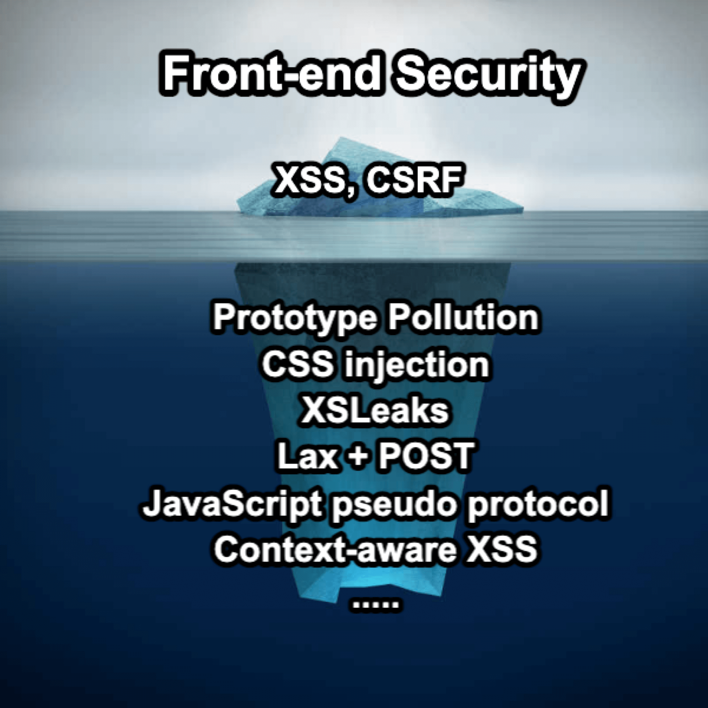
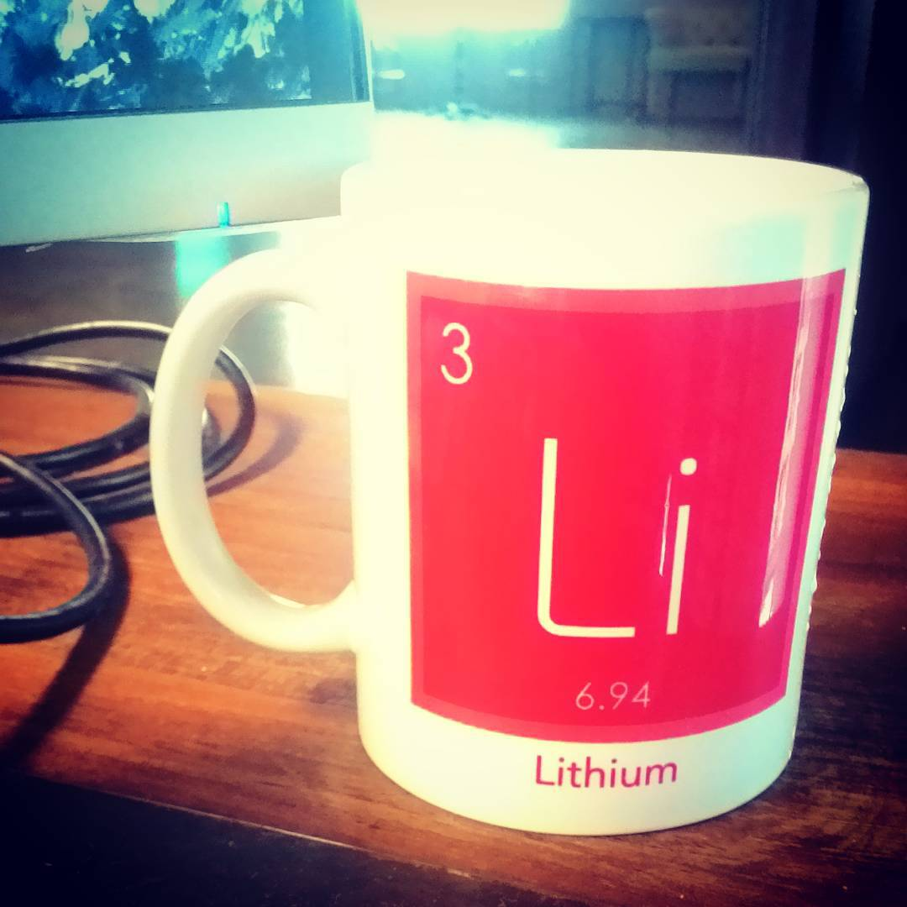

# 關於本書

身為一個軟體工程師，對資訊安全一定不陌生。在工作上的專案可能有經過資安的審核，包括靜態程式碼掃描、弱點掃描或是滲透測試等等，再更進階一點可能做過更全面的紅隊演練。除此之外，也可能聽過什麼是 OWASP，大概知道 OWASP top 10 包含了哪些東西，知道常見的資安漏洞有哪些。

但是當我們把範圍限縮，來談「網頁前端的資訊安全」時，應該不少人都只知道 XSS，然後就沒了。

如果把網頁前端資安的領域比喻成一個宇宙的話，XSS 或許就是那顆最大最亮的星球，佔據了多數人的目光。但除了它以外，在宇宙中還有很多沒這麼大的行星與恆星，它一直都在那，你只是沒發現而已。

除了 XSS 以外，還有很多值得學習的資安議題，例如說利用 JavaScript 特性的 prototype pollution、根本不需要 JavaScript 就能執行的 CSS injection 攻擊，或是網頁前端的旁路攻擊 XSLeaks 等等。

身為一個前端工程師，當我踏進資安的領域時，彷彿進入了另外一個世界。在那個世界中有著我熟悉的 HTML、CSS 與 JavaScript，但卻是從來沒見過的使用方式。做這行做了五六年，我以為大概八成的使用方法都看過了，但接觸資安之後才發現是顛倒過來，大概有八成的東西都沒見過！

因此，這個系列文希望能介紹給大家一些前端資安的議題，帶大家一起探索前端資安的宇宙！

內容會涵蓋的主題包括：

1. XSS (Cross-Site Scripting)
2. CSP (Content Security Policy)
3. Sanitization
4. HTML injection
5. CSS injection
6. DOM clobbering
7. Prototype pollution
8. CSRF (Cross-site request forgery)
9. CORS (Cross-origin resource sharing)
10. Cookie tossing
11. Cookie bomb
12. Clickjacking
13. MIME sniffing
14. XSLeaks (Cross-site leaks)
15. CSTI (Client side template injection)
16. Subdomain takeover
17. Dangling markup injection

而這個系列文大致上可以分成底下五個章節：

第一章：從 XSS 開始談前端資安  
第二章：XSS 的防禦方式以及繞過手法  
第三章：不直接執行 JavaScript 的攻擊手法  
第四章：跨越限制攻擊其他網站  
第五章：其他有趣的前端資安主題  

目標讀者是對資安有興趣的朋友們以及前端工程師，會預設大家至少知道一些基本的技術概念，例如說前後端的區別以及對於 HTML、CSS 與 JavaScript 的基本理解。

在資安的世界裡，知識量是很重要的，有些東西你不知道就是不知道，在開發的時候有可能根本不知道這樣寫會有問題，就無意間產生了一個資安漏洞。希望大家能夠從這個系列文中學到一些新知識，如果能讓你對前端資安感到興趣，那就太好了，但若是沒有的話，我也希望至少能讓大家看到前端的另一個樣貌，體會到我當時接觸資安時的感覺，簡單來說就是：「靠，怎麼我以前完全不知道這些東西」。

最後，資訊安全的領域既廣又深，如果我的文章裡面有任何技術上錯誤的地方，還請讀者們不吝指正，感謝。

## 本書的起源

會開始寫這一個系列，是因為 [2023 iT 鐵人賽](https://ithelp.ithome.com.tw/2023ironman/event)，這是一個需要連續 30 天發文的比賽，這也是為什麼這本書裡面有 30 篇文章。在活動中完成挑戰後，我便把裡面的文章內容獨立出來用 Docusaurus 架了這個網站，方便觀看全文內容。

## 關於我

可以直接參考我的部落格：https://blog.huli.tw/about/

Twitter: https://twitter.com/aszx87410

