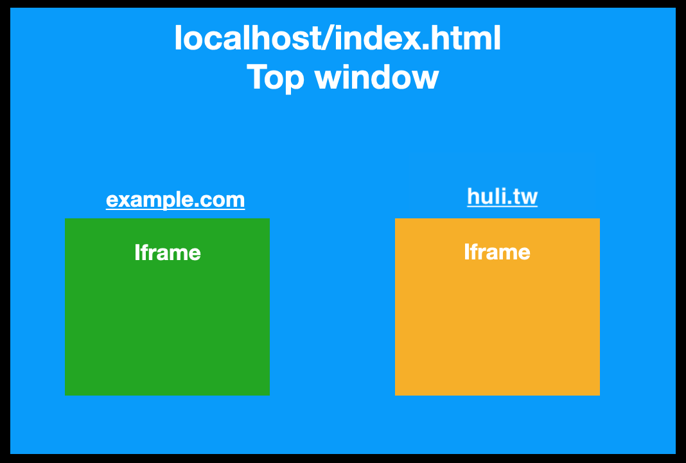

# What You See Is Not What You Get: Clickjacking

This is the beginning of Chapter 5, "Other Interesting Topics". In this final chapter, we will explore some security topics that are more difficult to categorize and cover a wider range of content.

First, let's take a look at clickjacking. Clickjacking is when you think you are clicking on something from Website A, but in reality, you are clicking on something from Website B. Your click is "hijacked" from Website A to Website B.

What harm can a simple click do?

Let's say the page behind it is a bank transfer page, and your account number and amount are already filled in. All it takes is one button click to transfer money out. This can be very dangerous (this is just an example, but it illustrates why a second layer of verification is needed for transfers).

Or let's take a more common example. Suppose there is a page that appears to be a cancellation page for a newsletter subscription. So you click the "Confirm Cancellation" button, but underneath it is actually a Facebook "Like" button. So not only did you not cancel the subscription, but you also inadvertently liked something. This type of attack is also known as likejacking.

Now, let's dive deeper into this attack method!

## Clickjacking Attack Principle

The principle of clickjacking is to overlay two web pages, where the user sees Website A but clicks on Website B.

In more technical terms, this is achieved by embedding Website B using an iframe with a transparency of 0.001, and then overlaying it with the content of Website A using CSS.

I find it most interesting and straightforward to understand clickjacking through examples. Please refer to the GIF below:


I thought I clicked Yes and unsubscribe the email, but in reality, I clicked "Delete Account." This is clickjacking. If you want to experience it yourself, you can try it on this webpage: [clickjacking example](https://aszx87410.github.io/demo/clickjacking-en/).

Some people may find this example too simple, and in actual applications, such simple attacks that only require one button click may be rare. Perhaps more websites will be more complex, requiring the user to enter some information first?

In the following example, clickjacking is designed for the "Change Email" feature. Unlike the previous example where the entire webpage is covered, this example intentionally leaves the input of the original webpage and overlays everything else with CSS. The button part uses `pointer-events:none` to allow events to pass through.

It appears to be a webpage for entering email subscription information, but after clicking "Confirm," it pops up with "Email Change Successful" because behind it is actually a webpage for changing the email:


A webpage version that you can interact with is also available: [Advanced clickjacking example](https://aszx87410.github.io/demo/clickjacking-en/adv.html).

The process of clickjacking attack can be summarized as follows:

1. Embed the target webpage into a malicious webpage (using iframes or similar tags).
2. Use CSS on the malicious webpage to overlay the target webpage, making it invisible to the user.
3. Redirect the user to the malicious webpage and prompt them to perform actions (such as input or clicks).
4. Trigger the behavior of the target webpage to achieve the attack.

Therefore, the difficulty of the attack depends on how well the malicious website is designed and how much interaction the target webpage requires. For example, clicking a button is much easier than entering information.

Also, it is worth noting that to carry out this type of attack, the user must already be logged into the target website. As long as the target webpage can be embedded into a malicious webpage, there is a risk of clickjacking.

## Defense against Clickjacking

As mentioned earlier, if a webpage cannot be embedded into another webpage, there is no risk of clickjacking. This is the fundamental solution to clickjacking.

Generally, there are two types of defense against clickjacking. One is to use JavaScript to check, and the other is to inform the browser through response headers whether the webpage can be embedded.

### Frame busting

One method called frame busting is to use JavaScript to check, as I mentioned earlier. The principle is simple, and the code is straightforward:

``` js
if (top !== self) {
  top.location = self.location
}
```

Each webpage has its own window object, and `window.self` refers to its own window. `top` refers to the top window, which can be thought of as the top-level window of the entire browser "tab."

If a webpage is opened independently, `top` and `self` will point to the same window. However, if the webpage is embedded in an iframe, `top` will refer to the window that uses the iframe.

Let's take an example. Suppose I have an index.html on localhost, which contains the following code:

```html
<iframe src="https://example.com"></iframe>
<iframe src="https://huli.tw"></iframe>
```

The relationship diagram would look like this:



The green and yellow represent two web pages loaded in iframes, which are two different windows. If you access `top` within these web pages, it will refer to the window object of `localhost/index.html`.

Therefore, by checking `if (top !== self)`, you can determine if the web page is being placed inside an iframe. If it is, you can change `top.location` to redirect the top-level web page elsewhere.

This sounds great and seems to have no issues, but it can be bypassed by the `sandbox` attribute of iframes. 

An iframe has an attribute called `sandbox`, which restricts the functionality of the iframe. If you want to remove the restrictions, you must explicitly specify them. There are many possible values, but I'll list a few:

1. `allow-forms` - Allows form submission.
2. `allow-scripts` - Allows JavaScript execution.
3. `allow-top-navigation` - Allows changing the top location.
4. `allow-popups` - Allows pop-up windows.

In other words, if I load the iframe like this:

```html
<iframe src="./busting.html" sandbox="allow-forms">
```

Even if `busting.html` has the protection I mentioned earlier, it won't work because it doesn't have `allow-scripts`, so JavaScript cannot be executed. However, users can still submit forms normally.

Therefore, someone came up with a more practical approach, making some improvements to the existing method (code taken from: [Wikipedia - Framekiller](https://en.wikipedia.org/wiki/Framekiller)):

``` html
<style>html{display:none;}</style>
<script>
   if (self == top) {
       document.documentElement.style.display = 'block'; 
   } else {
       top.location = self.location; 
   }
</script>
```

First, hide the entire web page, which can only be opened by executing JavaScript. So, if you block script execution with the sandbox mentioned above, you will only see a blank page. If you don't use the sandbox, the JavaScript check will fail, and you will still see a blank page.

Although this can achieve more comprehensive defense, there are also drawbacks. The drawback is that if users voluntarily disable JavaScript, they won't see anything. So, for users who disable JavaScript, the experience is quite poor.

When clickjacking first emerged in 2008, there were no such complete defense methods, so we had to use these workaround-like solutions. Now, browsers have better ways to block web pages from being embedded.

### X-Frame-Options

This HTTP response header was first implemented by IE8 in 2009, and other browsers followed suit. It became a complete [RFC7034](https://www.rfc-editor.org/rfc/rfc7034.txt) in 2013.

This header can have the following three values:

1. `DENY`
2. `SAMEORIGIN`
3. `ALLOW-FROM https://example.com/`

The first value rejects any web page from embedding this web page, including `<iframe>`, `<frame>`, `<object>`, `<applet>`, or `<embed>` tags.

The second value allows only same-origin web pages, and the last value allows embedding only from specific origins. Other than that, no embedding is allowed (only one value can be specified, so if multiple origins are required, they need to be dynamically adjusted on the server, similar to CORS headers).

The RFC specifically mentions that the determination of the last two values may differ from what you expect, and each browser's implementation may vary.

For example, some browsers may only check the "parent" and "top" layers, rather than checking every layer. What does "layer" mean? Because theoretically, an iframe can have an infinite number of layers, such as A embedding B embedding C embedding D, and so on.

If we represent this relationship in text, it would look like this:

``` 
example.com/A.html
--> attacker.com
    --> example.com/B.html
        --> example.com/target.html
```

For the innermost `target.html`, if the browser only checks the parent layer (B.html) and the top layer (A.html), then even if it is set to `X-Frame-Options: SAMEORIGIN`, the check will pass because these two layers are indeed the same origin. However, in reality, there is a malicious web page sandwiched in between, so there is still a risk of being attacked.

In addition, there is a second issue with `X-Frame-Options`, which is the poor support for `ALLOW-FROM`. As of now, in 2023, mainstream browsers do not support the `ALLOW-FROM` directive.

The initial `X` in `X-Frame-Options` indicates that it is more like a transitional solution. In modern browsers, its functionality has been replaced by Content Security Policy (CSP), which also addresses the aforementioned issues.

### CSP: frame-ancestors

CSP has a directive called `frame-ancestors`, which can be set as follows:

1. `frame-ancestors 'none'`
2. `frame-ancestors 'self'`
3. `frame-ancestors https://a.example.com https://b.example.com`

These three options correspond to the previous `X-Frame-Options` directives: `DENY`, `SAMEORIGIN`, and `ALLOW-FROM` (with support for multiple origins this time).

Let's clarify a potential confusion: the behavior restricted by `frame-ancestors` is the same as that of `X-Frame-Options`, which is "which web pages can embed me using an iframe." On the other hand, the CSP rule `frame-src` determines "which sources can be loaded on my web page."

For example, if I set `frame-src: 'none'` in index.html, any web page loaded within an iframe in index.html will be blocked, regardless of its own settings.

Another example: if my index.html is set to `frame-src: https://example.com`, but example.com has `frame-ancestors: 'none'` set, index.html still cannot load example.com within an iframe because it is rejected by the other side.

In summary, for an iframe to be successfully displayed, both parties must agree; if either party disagrees, it will fail.

Additionally, it is worth noting that `frame-ancestors` is a rule supported only in CSP level 2, gradually adopted by mainstream browsers starting from the end of 2014.

### Defense Summary

Due to varying levels of support, it is recommended to use both `X-Frame-Options` and CSP's `frame-ancestors`. If you do not want your web page to be loaded within an iframe, remember to add the following HTTP response headers:

```
X-Frame-Options: DENY
Content-Security-Policy: frame-ancestors 'none'
```

If you only allow same-origin loading, set it as:

```
X-Frame-Options: SAMEORIGIN
Content-Security-Policy: frame-ancestors 'self'
```

If you want to specify an allow list of sources, use:

```
X-Frame-Options: ALLOW-FROM https://example.com/
Content-Security-Policy: frame-ancestors https://example.com/
```

Finally, there is another defense mechanism that browsers have already implemented. Can you recall what it is?

It is the default `SameSite=Lax` cookie! With this, web pages embedded within iframes will not send cookies to the server, thus not meeting the prerequisite for clickjacking attacks, which is "the user must be logged in." From this perspective, in addition to CSRF mentioned earlier, same-site cookies also address many other security issues.

## Real-world Examples

### Yelp

In 2018, hk755a reported two clickjacking vulnerabilities to Yelp, the largest restaurant review website in the United States. The vulnerabilities were titled: [ClickJacking on IMPORTANT Functions of Yelp](https://hackerone.com/reports/305128) and [CRITICAL-CLICKJACKING at Yelp Reservations Resulting in exposure of victim Private Data (Email info) + Victim Credit Card MissUse.](https://hackerone.com/reports/355859).

One of the reports discussed the reservation page of a restaurant. After entering the page, the user's personal information is automatically filled in, and they can successfully make a reservation by clicking a button. Therefore, the target of clickjacking is this reservation button.

What are the consequences if the user unknowingly clicks the reservation button? First, the attacker can register a restaurant and:

1. See the information of the people who made the reservation and steal their email addresses.
2. To cancel a reservation, a cancellation fee must be paid. The attacker can collect the money.

Even without registering a restaurant, it is still possible to attack. For example, if I dislike a certain restaurant, I can intentionally share their reservation page and create many fake reservations, making it difficult for the restaurant to distinguish between genuine and fake bookings.

### Twitter

Let's first look at the vulnerability reported by filedescriptor to Twitter in 2015: [Highly wormable clickjacking in player card](https://hackerone.com/reports/85624).

This vulnerability is quite interesting and exploits the browser implementation issues mentioned earlier.

In this case, Twitter had already set `X-Frame-Options: SAMEORIGIN` and `Content-Security-Policy: frame-ancestors 'self'`. However, during the implementation check in some browsers, only the top window was checked for compliance.

In other words, if it was twitter.com => attacker.com => twitter.com, it would pass the check, allowing malicious web pages to be embedded.

Furthermore, this vulnerability occurred in Twitter's timeline, so it could achieve a worm-like effect. After clickjacking, it would send tweets, which would be seen by more people, resulting in more people sending the same tweets.

The author's writeup is excellent, but the blog is down. Here is an archive: [Google YOLO](http://web.archive.org/web/20190310161937/https://blog.innerht.ml/google-yolo/)

Another report was submitted by eo420 to Periscope, a subsidiary of Twitter, in 2019: [Twitter Periscope Clickjacking Vulnerability](https://hackerone.com/reports/591432).

This bug was due to compatibility issues. The web page only set `X-Frame-Options: ALLOW-FROM` without setting CSP, which is not effective because modern browsers do not support `ALLOW-FROM`. The impact it can cause is that there is a "Deactivate Account" button on the website, which can mislead users into clicking it without their knowledge.

The solution is simple, just use the `frame-ancestors` CSP that is supported by current browsers.

### Tumblr

In 2020, fuzzme reported a vulnerability to Tumblr: [[api.tumblr.com] Exploiting clickjacking vulnerability to trigger self DOM-based XSS](https://hackerone.com/reports/953579).

I specifically chose this case because it is a chain of attacks!

Previously, there was a type of vulnerability called self-XSS, where only the user could trigger XSS. Therefore, many bug bounty programs do not accept this type of vulnerability because it has little impact.

This report combines self-XSS with clickjacking, allowing users to trigger self XSS through clickjacking, making the attack easier to achieve and more feasible.

How does this chaining work?

First, the user is prompted to click a button, secretly copying the XSS payload in the background. Then, the user is asked to paste it into another input field and click another button. That input field is actually the username field, and the final button is "Update Data". By following the instructions, the user unknowingly changes their username to the XSS payload.

These are some practical examples related to clickjacking. It is worth noting that some issues are caused by compatibility problems rather than misconfigurations, so correct configuration is also important.

## Unpreventable Clickjacking?

The defense against clickjacking is essentially not allowing others to embed your web page. But what if the purpose of the web page is to allow others to embed it? What should be done in the case of widgets like the Facebook widget, which includes the "Like" and "Share" buttons that are meant to be embedded using iframes?

According to these two articles:

1. [Clickjacking Attack on Facebook: How a Tiny Attribute Can Save the Corporation](https://www.netsparker.com/blog/web-security/clickjacking-attack-on-facebook-how-tiny-attribute-save-corporation/)
2. [Facebook like button click](https://stackoverflow.com/questions/61968091/facebook-like-button-click)

The information obtained inside may currently only reduce user experience a bit in exchange for security. For example, after clicking a button, a popup will appear for confirmation, which adds an extra click for the user but also avoids the risk of likejacking.

Alternatively, I speculate that this behavior may also depend on the source of the website. For example, on more reputable websites, this popup may not appear.

I have created a simple demo webpage: [https://aszx87410.github.io/demo/clickjacking/like.html](https://aszx87410.github.io/demo/clickjacking-en/like.html)

If likejacking is successful, clicking the button will like the Facebook Developer Plugin's page (I have successfully tested it myself). You can try it out and then click "Show Original page" to see what is under the button, and also unlike the page.

## Conclusion

Compared to the time when browser support was not as complete, we are much better off now. Browsers have implemented more and more security features and new response headers to protect users from malicious attacks.

Although clickjacking has become increasingly difficult to achieve with the advent of default same-site cookies, it is still important to remember to set the `X-Frame-Options` and CSP mentioned in the article. After all, that's how cybersecurity works, having an extra layer of protection is always good.

References:

1. [TOPCLICKJACKING.md](https://github.com/reddelexc/hackerone-reports/blob/master/tops_by_bug_type/TOPCLICKJACKING.md)
2. [Clickjacking Defense Cheat Sheet](https://cheatsheetseries.owasp.org/cheatsheets/Clickjacking_Defense_Cheat_Sheet.html#x-frame-options-header-types)
3. [CSP frame-ancestors](https://content-security-policy.com/frame-ancestors/)
